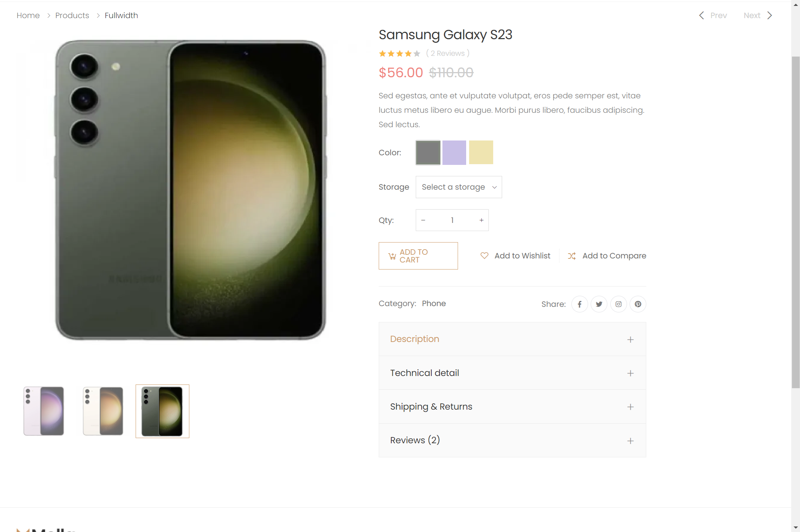
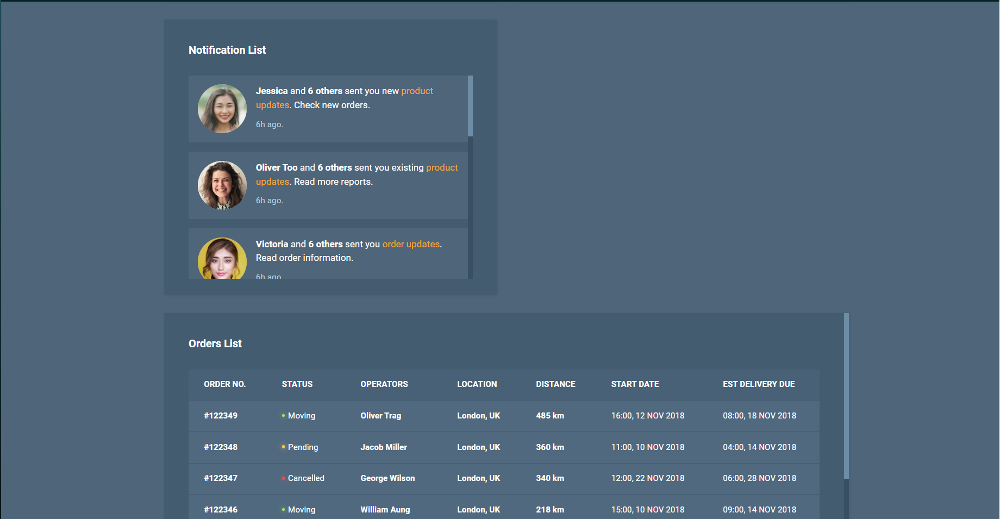
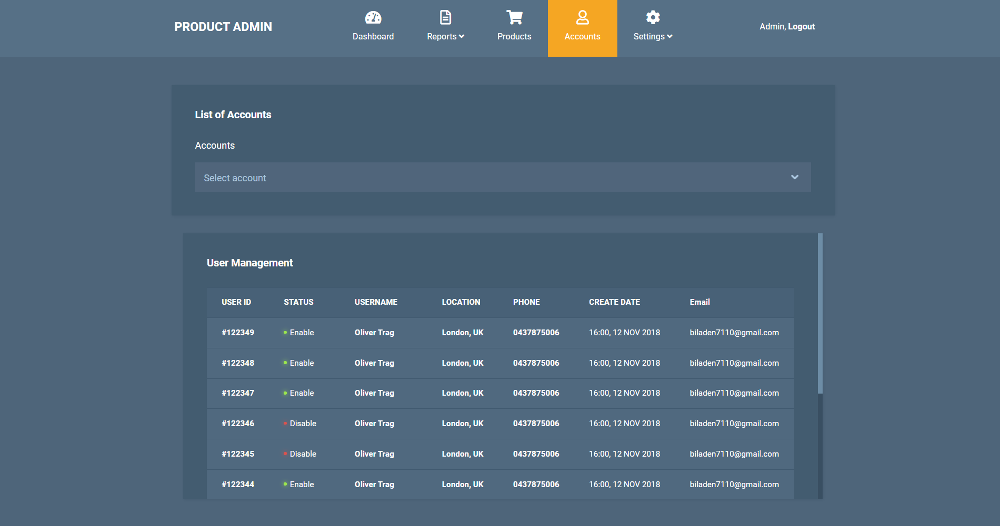

# Members:

- Đặng Mai Anh Tú - SE182951
- Nguyễn Minh Khoa - SE183889
- Lê Thị Ánh Hồng - SE181508
- Nguyễn Thị Hồng Hạnh - SE181585

# Dế Lửa Store

- _Online store for selling smartphone, tablet, laptop._
- _Retailer manage and sell thier products._
- _Customer can buy,view,compare products online easily._

## 1. Requirements:

### Customer:

- Login/ Signup by username/password, by Google.
- Add to cart function for customer with add shiping address, phone number, email,...
- Search and filter products by brand name, product type, price.
- Sort product by price asc/desc,
- Review/ comments about product.
- Display product's price, discount, technical details .

### Admin (Retailer):

- Product mangement: add, delete, modify product information, technical details.
- Display contact info (phone number, email. fanpage) and anddress.
- Revenue statistics -> export to .xlxs file.
- Banner for advertising new products or discount program.
- Orders management: View, reject, approach, change status of the order.
- Users management: Can enable/disable, add new, delete user.

## 2. Preview Screenshot

**1. Guest:**  
&nbsp;
&nbsp;
&nbsp;
&nbsp;
&nbsp;
&nbsp;
&nbsp;
&nbsp;
&nbsp;
&nbsp;

**2. Admin:** 

&nbsp;
&nbsp;
&nbsp;
&nbsp;
&nbsp;
&nbsp;
&nbsp;
=======
&nbsp;
&nbsp;
&nbsp;
&nbsp;
&nbsp;
&nbsp;
&nbsp;

## 3. Database design:

&nbsp;

## 4. System Design:

&nbsp;
&nbsp;

## 5. Conclusion:
### 5.1 Pros and cons of your application:
### Pros

- Comprehensive functionality for an online sales website.
- High performance and smooth UI.
- Accurate data retrieval from SQL.
- Users can sign in/sign up, view products, add product to cart, make order online, filter products by many category and brand, edit personal information.
- Admin  view and change status of orders, add,delete products, view and change status of user.
- Admin can disable/enable account of user.

### Cons
- The function add multiple variants,edit product and image processing is not completed .
- Admin just can disable or enable user account but can not edit user infomation.
- Function view order detail in admin is not completed.
- View product detail UI not convinient for user to choose variant to add to cart.

### 5.2 Lessons Learned During Development:
- Consider and carefully build the database to avoid unnecessary changes that could impact work progress.
- We ran into code conflicts when pulling the latest changes because we were editing the same lines of code. After that we learn how to use git to manage code in a team. Advoid and handle code conflig when pull and push code.
- The lack of clear d tasks slowed down progress. The lesson that is our team need to held a meeting to clarify roles,function ivision of,assign each person to manage a specific DAO before coding.
- Learn how to use AI to help us do simple work but take many time. Generate dataset, fix bug, make DTO, add CSS. 
### 5.3 Future Improvements
- Implement image compression and lazy loading techniques to enhance website performance, especially when loading images..
- Using transactions ensures more accurate management of orders and profits during the purchasing process.
- Complete the feature to view order details in user ui and in the Admin Dashboard .
- implement QR code payment method 
- Minimize page reloads 
